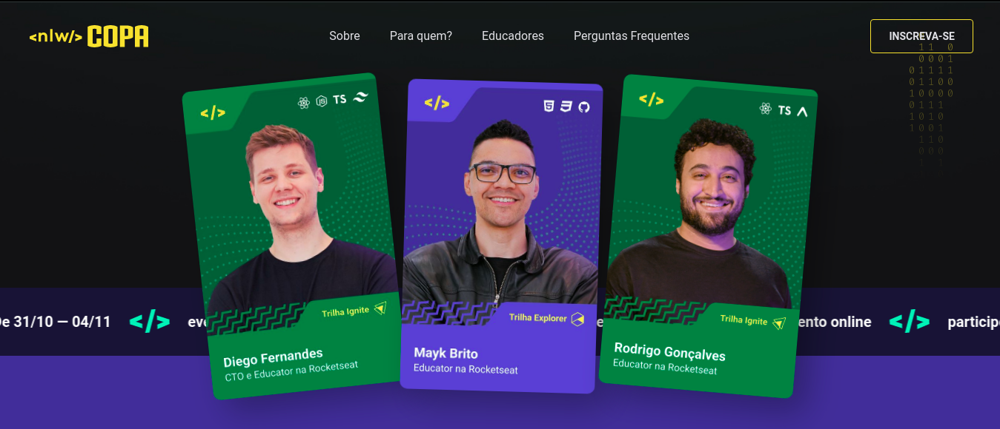

<h1 align="center">
    
</h1>

  

  
  
  

  

  

  <a href="#-tecnologias">Tecnologias</a>&nbsp;&nbsp;&nbsp;|&nbsp;&nbsp;&nbsp;
  <a href="#-projeto">Projeto</a>&nbsp;&nbsp;&nbsp;|&nbsp;&nbsp;&nbsp;
  <a href="#-layout">Layout</a>&nbsp;&nbsp;&nbsp;|&nbsp;&nbsp;&nbsp;
  <a href="#memo-licença">Licença</a>

 

Pode acessar a pagina por <a href='https://lucianocoelho-28.github.io/card_copa/'> Aqui</a>

  

## 🚀 Tecnologias

Esse projeto foi desenvolvido com as seguintes tecnologias:

- HTML
- CSS
- JavaScript

Bibliotecas

- [Google Fonts](https://fonts.google.com/)
- [SwipeJS](https://github.com/nolimits4web/Swiper)
- [ScrollRevel](https://scrollrevealjs.org)

Utilitários

- [randomuser.me](https://randomuser.me/photos)
- [IconMoon](https://icomoon.io/app/#/select)

## 💻 Projeto

Já pensou em criar sua própria figurinha da copa usando HTML e CSS?
Usando um layout do Figma como base, vamos criar o projeto em código e adicionar uma funcionalidade de troca de fundo de cartão, com JavaScript. 
Também vamos criar um link para compartilhar pelo no Github Pages. 
Além de diversas dicas, desde ajustes das configurações do VS Code até os próximos passos pra sua carreira.

## 🔖 Layout

Você pode visualizar o layout do projeto através [desse link](https://www.figma.com/file/n4a3jhGZQzysXClp99bfyT/NLW-Copa-Card/duplicate). É necessário ter conta no [Figma](https://figma.com) para acessá-lo.

## :memo: Licença

Esse projeto está sob a licença **MIT**. Veja o arquivo [LICENSE](LICENSE) para mais detalhes.

---
